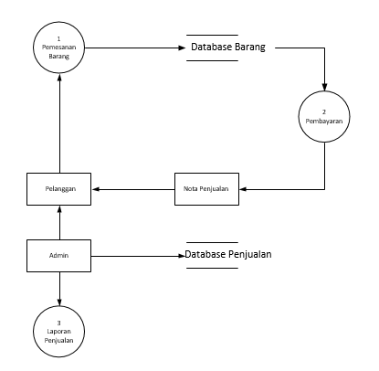
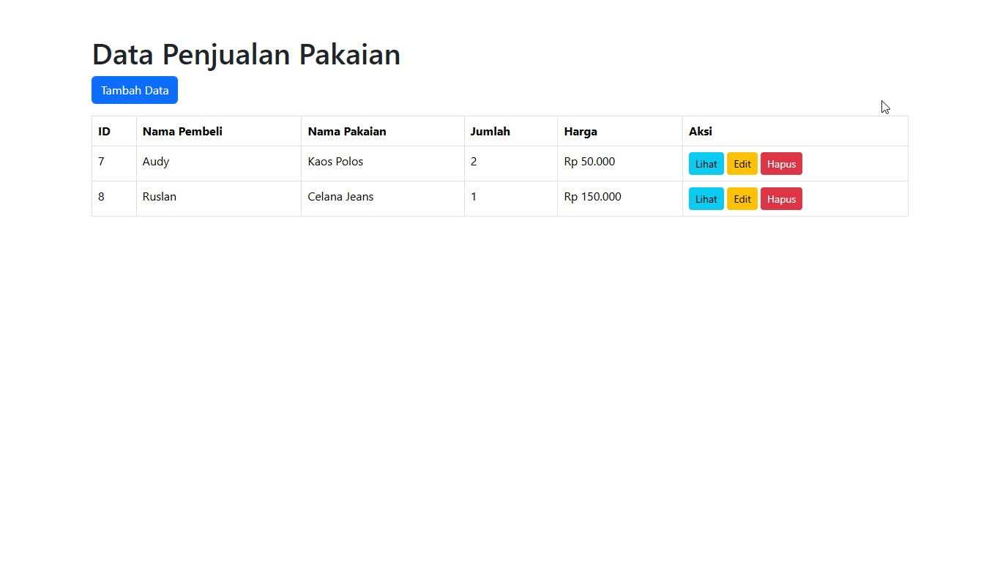
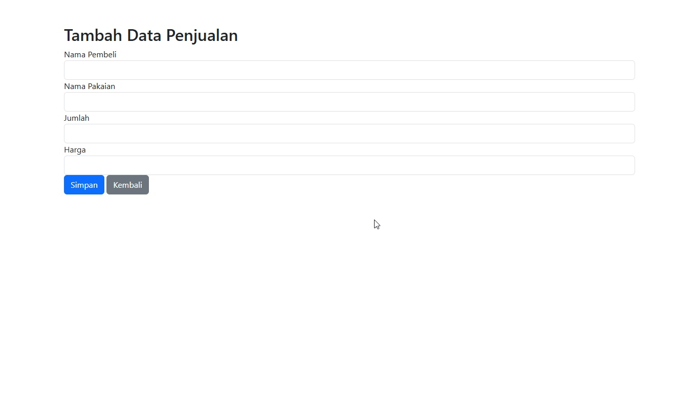
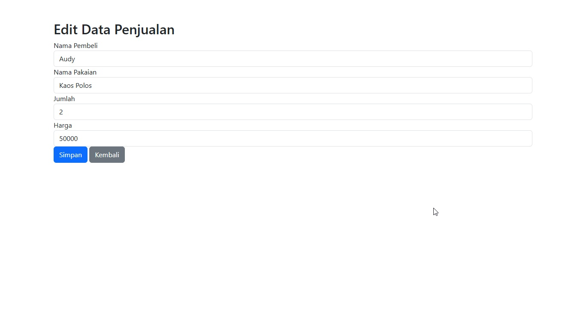
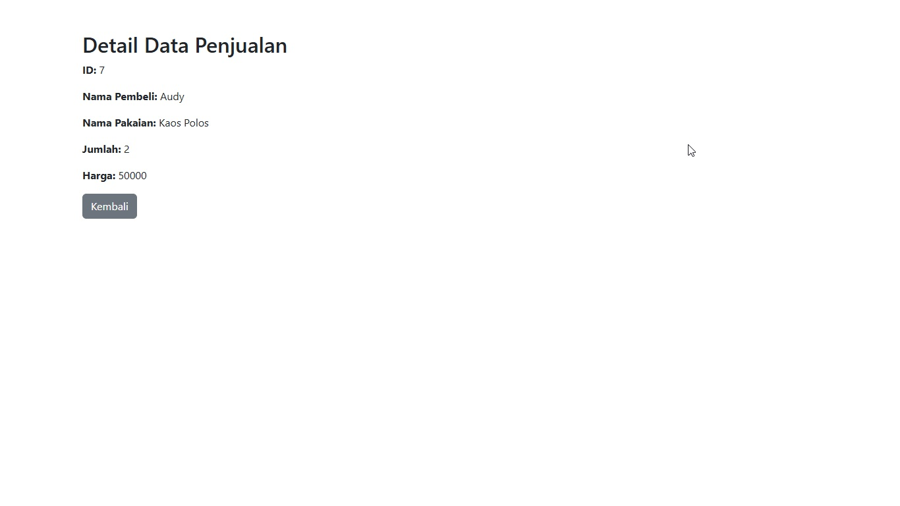
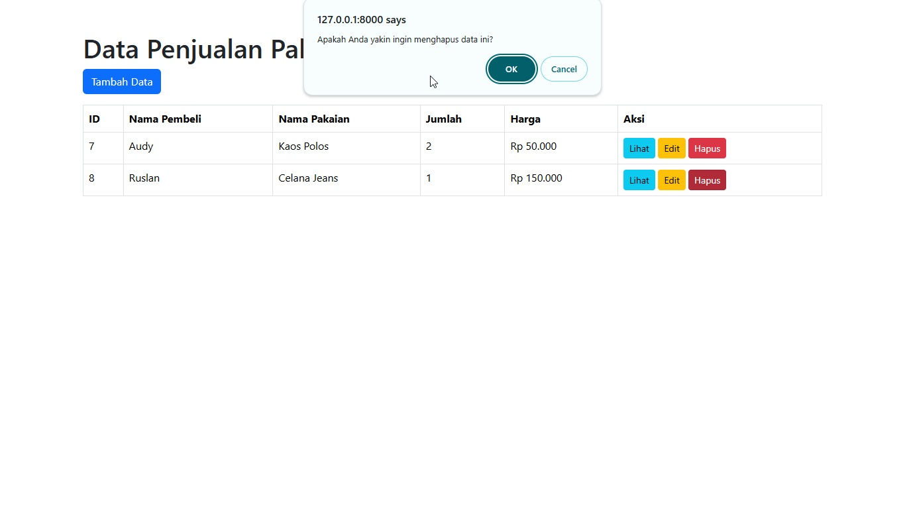

# Aplikasi CRUD Penjualan Pakaian - SPA JQuery Ajax

Aplikasi ini adalah sebuah aplikasi CRUD Sederhana berbasis Single Page Application (SPA) yang dibangun menggunakan JQuery dan Ajax untuk melakukan operasi CRUD (Create, Read, Update, Delete) pada data penjualan pakaian.

## Diagram Alir Data (DFD)

### Gambar 1: Diagram Alir Data (DFD)




### Penjelasan DFD

- **Pelanggan** mengirimkan pesanan ke **Proses 2: Pemesanan Barang**.
- **Proses 2** mengecek **Database Barang** untuk stok, lalu mengirimkan data ke **Proses 3: Pembayaran**.
- **Proses 3** menghasilkan **Nota Penjualan** untuk Pelanggan.
- **Admin/Kasir** dapat memproses transaksi dan melihat **Laporan Penjualan** dari **Database Penjualan**.

Diagram ini mencakup entitas dan aliran data utama dalam proses penjualan barang pakaian.

## Screenshot Aplikasi

### Gambar 1: Home Data


### Gambar 2: Tambah Data


### Gambar 3: Ubah Data


### Gambar 4: Lihat Data


### Gambar 5: Hapus Data


## Proses Instalasi

1. **Download Project atau Cloning**
   - Anda dapat mendownload project ini langsung atau melakukan cloning menggunakan perintah berikut:
     ```bash
     git clone https://github.com/audyruslan/Penjualan-Pakaian---Laravel-SPA-JQuery-Ajax.git
     ```

2. **Composer Install**
   - Jalankan perintah berikut untuk menginstall dependencies:
     ```bash
     composer install
     ```

3. **Migration dan Seeder**
   - Lakukan migration dan seeder untuk mengatur database:
     ```bash
     php artisan migrate
     php artisan migrate:fresh --seed
     ```

4. **Jalankan Project**
   - Jalankan project dengan perintah berikut:
     ```bash
     php artisan serve
     ```
